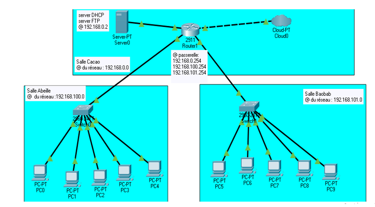

# création du réseau d’un centre de formation

    

•	Définir l’adressage réseau des différents équipements et mettre en place le réseau local

•	Mettre en place un serveur DHCP, DNS,  NFS

•	Creation d’un script shell qui permet de configurer un poste (hostname, ajoute d’un utilisateur,…) à partir d’une machine fraîchement installée mais également de “réinitialiser” le poste en fin de formation en vue d’une utilisation lors d’un futur stagiaire.

**Outils : Debian , isc-dhcp-server , bind9, nfs-kernel-server, shell, switch , routeur**
